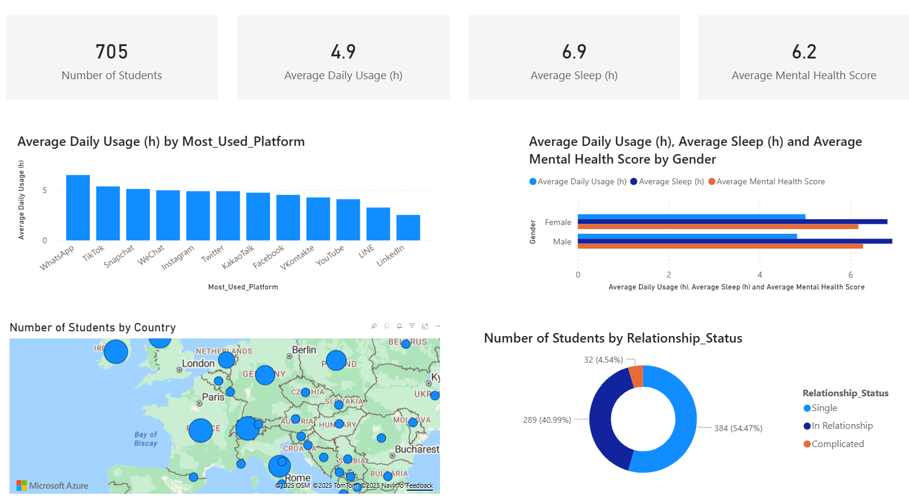

# 🎓 11-powerbi-dashboard-student_socialmedia_insights

Ce projet analyse les comportements liés aux réseaux sociaux chez les étudiants âgés de 16 à 25 ans dans plus de 20 pays, en mettant en lumière les liens potentiels avec le sommeil, la santé mentale, les conflits relationnels et la performance académique.

## 📊 Objectif

- Explorer les usages intensifs des plateformes sociales
- Évaluer leur impact sur le bien-être des étudiants
- Mettre en lumière les différences selon le genre, le pays, ou le statut amoureux
- Construire un tableau de bord visuel interactif (Power BI)

## 🧠 Dataset

- **Nom** : Student Social Media & Relationships
- **Source** : Simulation (inspiré d’une enquête académique fictive)
- **Taille** : ~700 étudiants, 13 variables
- **Colonnes clés** :
  - `Avg_Daily_Usage_Hours`, `Mental_Health_Score`, `Sleep_Hours_Per_Night`
  - `Most_Used_Platform`, `Country`, `Relationship_Status`, `Addicted_Score`

## 📁 Structure du projet

| Dossier       | Contenu |
|---------------|---------|
| `data/`       | Données CSV nettoyées (si partageable) |
| `powerbi/`    | Fichier `.pbix` du rapport |
| `images/`     | Captures d’écran du dashboard |
| `docs/`       | Documentation sur la méthodologie, formules DAX, etc. |

## 📌 Aperçu du dashboard

## 🛠️ Outils

- **Power BI Desktop**
- **DAX** (mesures personnalisées)
- **Microsoft Fabric** (optionnel)
- **GitHub** pour la gestion de version

## ✨ Exemples d’indicateurs

- Moyenne d’utilisation quotidienne par plateforme
- Score moyen de santé mentale selon le genre
- Pourcentage d’impact académique auto-déclaré
- Nombre moyen de conflits amoureux liés aux réseaux sociaux
